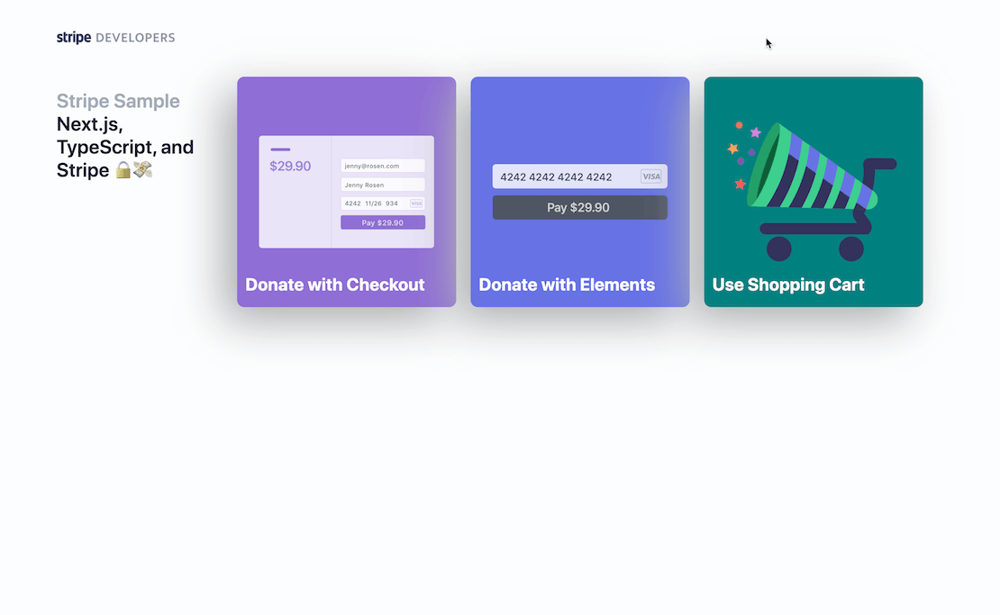

# next-prisma-stripe-sample

next-prisma-stripe-sample のリポジトリです。

## Overview

- RBD （Next.js API Routes & Prisma & Vercel Postgres）を学ぶ為に作成。
- 本のシェアと本探しが簡単に！ウェブアプリ「BooxMix」を参考に開発を進めています。
- http://bookpooh.com/archives/18817

## 環境

```
frontend：Next.js, TypeScript
css：CSS Modules
backend：Next.js API Routes
orm：Prisma
db：Vercel Postgres
storage：GCS
auth：NextAuth.js
hosting：Vercel
libs：react-hook-form, zod, SWR, SendGrid, ChatGPT, use-shopping-cart, Stripe
```

## Installation

- clone

```bash
$ git clone git@github.com:1zumisawashun/next-prisma-stripe-sample.git
$ cd next-prisma-stripe-sample
```

- install

```bash
$ npm install
```

- ローカル開発用 URL を開き動作確認をする

```bash
$ npm run dev
```

http://localhost:3000/

- 上記の手順で失敗する場合 [Troubleshoot](#Troubleshoot)を確認してください

## erd

<!--  -->

<!-- ## demo

 -->

## How to

- フォーマットを効かせる

```bash
$ npm run lint
```

## Troubleshoot

- なし

## その他ドキュメント

- CSS Modules を採用した背景  
  https://zenn.dev/shuuuuuun/scraps/744aa994686183

See [Configuration Reference](https://github.com/vercel/next.js/tree/canary/examples/with-stripe-typescript).
